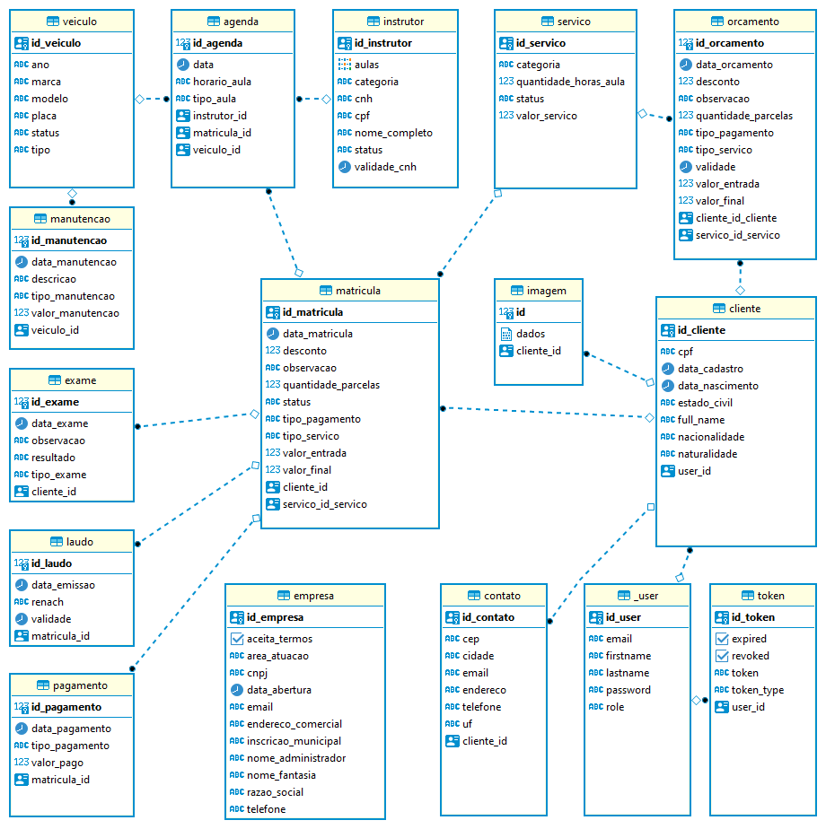

# Sistema de Gestão de Serviços e Equipamentos

## ✔️ Técnicas e tecnologias utilizadas

- ``Java``
- ``Maven``
- ``JPA``
- ``Lombok``
- ``Spring Boot``
- ``PostgreSQL``
- ``InteliJ IDEA``
- ``JWT``
- ``Swagger``

### Ajustes e melhorias

O projeto ainda está em desenvolvimento e as próximas atualizações serão voltadas nas seguintes tarefas:

- [ ] Empresa
  

 Banco de Dados

# Autores

| [ Ranelho Lacerda](https://github.com/ranelho) | [ Jonh Everton](https://github.com/JohnEverton-Dev) | [ Matheus Prata](https://github.com/matheusprata) |
|:---------------------------------------------------------------------------------------------:|:-------------------------------------------------------------------------------------------------:|:-----------------------------------------------------------------------------------------------:|

[⬆ Voltar ao topo](https://github.com/ranelho/gestao-servicos) 